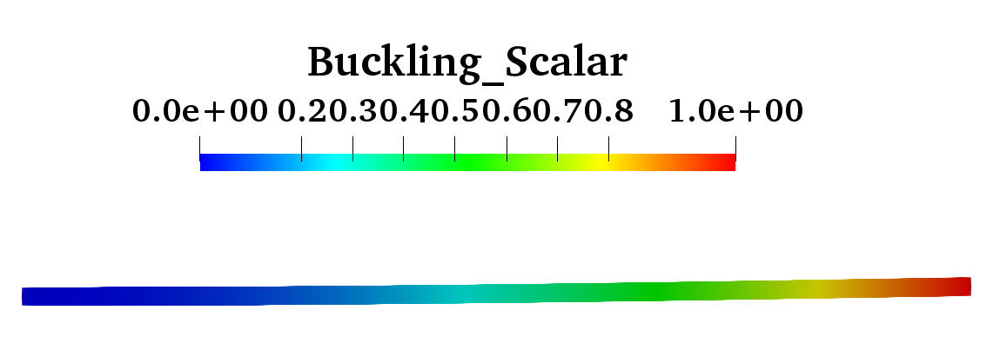

# 2次元線形座屈解析
## 入力コマンド
```
$ cp ./examples/cantilever2D_TO/*.dat ./examples/cantilever2D_TO/*.prm  ./data-input/
$ ./bin/fem
```

## 結果
- 長さ100mm, 幅2mm, 厚さ2mm柱の線形座屈解析
- 片端固定、片端自由
- 解析結果座屈荷重：73.762N (オイラー座屈荷重：65.8N)

 