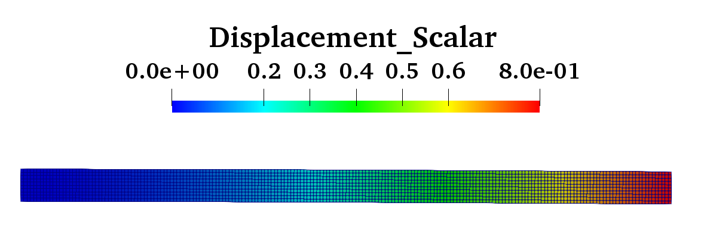
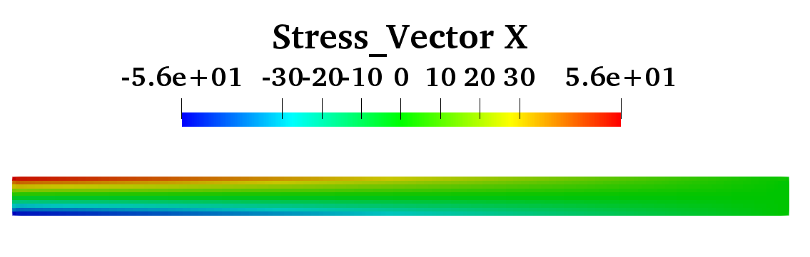

# 2次元片持ち梁の静解析検証

## 入力コマンド
```
$ cp ./examples/cantilever2D_FEA/*.dat ./examples/cantilever2D_FEA/*.prm  ./data-input/
$ ./bin/fem
```

## 結果
 
- 先端最大変位：0.797559mm（理論値：0.80mm）
 
- x方向応力最大値：55.7126MPa（理論値：60.0MPa)

## 参考
- https://www.fem-vandv.net/m12.html